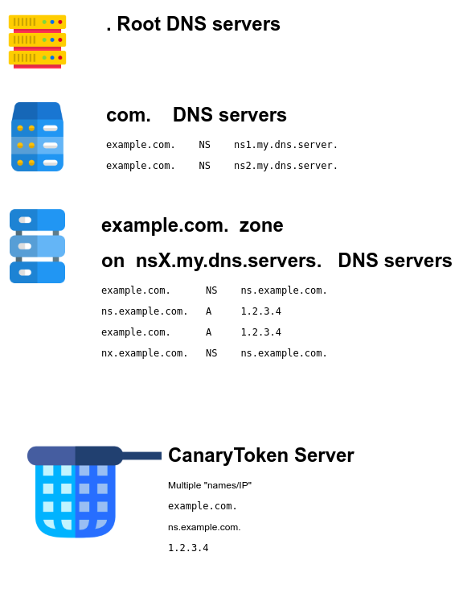

Dockerized Canarytokens
=======================
by Thinkst Applied Research

Overview
--------
Canarytokens helps track activity and actions on your network.

Prerequisites
-------------
* At least one domain name. If you want to enable PDF-opening tracking, you will need one domain name + a sub-domain (or two domain names).
* Internet-facing Docker host. You can [install Docker on a Linux host](https://docs.docker.com/installation/) quickly.

What's new?
-----------
We are going to track some new features/additions here so that it is quick and easy to see what has been recently added.

- we've renamed the distributed .env files to ```switchboard.env.dist``` and ```frontend.env.dist```. This ensures that your local
  configuration doesn't get blown away when you pull changes from the repo. (We still use ```switchboard.env``` and ```frontend.env```
  for the config, it just means that new clones of the repo require the users to copy / rename the dist files)
- we have added an extra `switchboard.env` called `CANARY_IPINFO_API_KEY`. This allows you to use your ipinfo.io api key if you
  want to (keep in mind ipinfo.io does have a free tier of up to 1000 requests a day).
- we now have slack support. When you supply a webhook, you simply supply your slack webhook url. (Thanks to @shortstack).
- we have added a new environment variable to `frontend.env` called `CANARY_AWSID_URL` which allows you to specify a private or
  different url for the AWS ID token. This means you can easily change between accounts. (2018-10-17)


## Domain name / DNS configuration

You register a domain name using a "registrar". This "registrar" has a communication channel with the "registry" which is the entity managing the TLD (`.com` for example).

The registry operate some DNS servers that list domain names available into it's TLD, with the corresponding "next" DNS servers in the chain to send requests to for further records inside this domain zone.

You configure in admin panel of you registrar, what DNS servers you want the registrar to "push" into the DNS servers managed by the registry.


- Registry DNS level

This information is defined into the Registrar admin panel (then pushed to Registry DNS servers)

```
example.com.    NS    ns1.my.dns.servers.
example.com .   NS    ns2.my.dns.servers.
```


- Domain DNS level

On `nsX.my.dns.servers.`  DNS servers, configure the following example of zone content

```
ns.example.com.       A     1.2.3.4
example.com.          NS    ns.example.com.
example.com.          A     1.2.3.4
nx.example.com.       NS    ns.example.com.
```

You must set your CanaryToken server as "NS" for your domain name. NS record can't be an IP address, so you must also define a name. Here we  decided to name our "NS" server with the not-too-suspicious name "ns" just because "canarytoken" may looks far too suspicious :)

`1.2.3.4` is the public IP of the Docker host.

`nx.example.com` is a name to be used by the PDF token and to be set into `CANARY_NXDOMAINS=` variable.





Note: At the registrar, you can choose  what DNS servers you want to use for your domain name. In most cases, the registrar give you the opportunity to configure your domain, to use the registrar free DNS servers (ex: `ns.myregistrar.com`), and in this case, you can edit the zone DNS records also into the Registrar admin panel.

But in our specific case, we want a very special setup with a very special DNS server (our canary token server), and we want to set the `NS` record accordingly. **Most registrars that will offer you to "host" the DNS ervers for your domain name, will NOT let you configure your zone file with NS records that are different to those you also asked to use at the registry level** as such special setup would usually break the domain name availability for most people.

You may get errors when creating the "other" NS record, or you could simply not be allowed to configure any NS records into the zone file.

Workaround in such case is to NOT use the Registrar DNS servers.. but instead use "external DNS servers", then you will edit your zone file on that "external" DNS provider which can be your own DNS server or some other free available.


Setup (in Ubuntu)
-----------------

* Boot your Docker host, and take note of the public IP.
* Clone the Docker setup:
```
$ git clone https://github.com/thinkst/canarytokens-docker
$ cd canarytokens-docker
```
* Install Docker compose (if not already present):
```
$ sudo apt-get install python-pip python-dev
$ sudo pip install -U docker-compose
#if this breaks with PyYAML errors, install the libyaml development package
# sudo apt-get install libyaml-dev
```

* We distribute two .env files that will be used for configuration, namely  ```switchboard.env.dist``` and ```frontend.env.dist```. You'll need to copy / rename them to ```switchboard.env``` and  ```frontend.env``` respectively (this ensures that your configuration doesn't get blown away if you pull changes). Once that is done, you can edit them:

1) Set the values for `CANARY_DOMAINS` in ```frontend.env```. These must be domains you own because you will need to add an A record to each `CANARY_DOMAINS` specified pointing the domain towards your docker's public IP.

2) [NOTE: This step is only necessary if you want to use PDF tokens] Set the values for `CANARY_NXDOMAINS` in ```frontend.env```. These must be domains you own because you will need to add an NS record to each `CANARY_NXDOMAINS` specified pointing the domain towards your previously specified `CANARY_DOMAINS`.

3) Uncomment 'CANARY_PUBLIC_DOMAIN' in ```switchboard.env``` and set it to one of the domains defined for `CANARY_DOMAINS` in ```frontend.env```(if you do not uncomment and set it, the Public IP will be used).

4) Next decide on which email provider you want to use to send alerts. 

If you are using Mailgun to send emails, uncomment `CANARY_MAILGUN_DOMAIN_NAME` and `CANARY_MAILGUN_API_KEY` from ```switchboard.env``` and set the values.  

If you are using Mandrill or Sendgrid instead, uncomment the appropriate API key setting and set it.

If you are using your own SMTP server, use `CANARY_SMTP_SERVER`,`CANARY_SMTP_PORT`, `CANARY_SMTP_USERNAME`, `CANARY_SMTP_PASSWORD`.


* Here's example files for a setup that generates tokens on example1.com, example2.com and example3.com (PDFs), running on a host with public domain 'my.domain' and IP 1.1.1.1, using Mailgun Domain Name 'x.y' and API Key 'zzzzzzzzzz':

  * frontend.env
```
#These domains are used for general purpose tokens
CANARY_DOMAINS=example1.com,example2.com

#These domains are only used for PDF tokens
CANARY_NXDOMAINS=example3.com

#Requires a Google API key to generate incident map on history page
#CANARY_GOOGLE_API_KEY=

```
  * switchboard.env (Example using Mailgun for email)
```
CANARY_MAILGUN_DOMAIN_NAME=x.y
CANARY_MAILGUN_API_KEY=zzzzzzzzzz
#CANARY_MANDRILL_API_KEY=
#CANARY_SENDGRID_API_KEY=
CANARY_PUBLIC_IP=1.1.1.1
CANARY_PUBLIC_DOMAIN=my.domain
CANARY_ALERT_EMAIL_FROM_ADDRESS=noreply@example.com
CANARY_ALERT_EMAIL_FROM_DISPLAY="Example Canarytokens"
CANARY_ALERT_EMAIL_SUBJECT="Canarytoken"
```
* Finally, download and initiate the images:
```
$ docker-compose up
```
* The frontend and switchboard will now be running in the foreground. The frontend is accessible at http://example1.com/generate. If you wish to run this in the background, you may use
```
$ docker-compose up -d
```

NOTE: If you only own one domain, and would like to use pdf tokens, you can use subdomains for `CANARY_NXDOMAINS`. Using `example.com` as our domain, you can set `CANARY_NXDOMAINS` to `nx.example.com`. 

Persisting data
---------------

The tokens are saved in a Redis database file which exists outside of the Docker containers. Look for ```dump.rdb``` in the ```canarytokens-docker/data``` directory.

If you want to wipe all your tokens, delete dump.rdb.

It's 2018: I want HTTPS!
-----------------------
We have a separate docker compose file which will automate (mostly) getting you up and running a Canarytokens server with HTTPS.
You will need to do the following:

* Edit the ```certbot.env```. You will need to provide your domain and email address (these are necessary for the certbot's registration process).
E.g.
```
MY_DOMAIN_NAME=example.com
EMAIL_ADDRESS=jay@example.com
```
* Now when you want to bring up your server, you will use ```docker-compose -f docker-compose-letsencrypt.yml up``` which will run the
server in the foreground so you can make sure everything gets started alright.

* If everything is running, you may want to CTRL+C, run ```docker-compose -f docker-compose-letsencrypt.yml down``` to get to a clean slate and then rerun ```docker-compose -f docker-compose-letsencrypt.yml up -d``` with the added ```-d``` to run the server in the background (in daemon mode)

* Please keep in mind that using the HTTPS method will use the email you specified and the domain name to register the certificate. You can read about the lets encrypt process (using cerbot) over [here](https://certbot.eff.org/lets-encrypt/ubuntuxenial-nginx). The process involves verifying that you are the owner of the domain you have specified and registering you with lets encrypt.

* THERE IS A RATE LIMIT. So don't keep bringing this server up and down otherwise you will quickly hit a lets encrypt certificate generation limit. To avoid this, for testing purposes you may add ```--staging``` to the ```./certbot-auto``` command in ```cerbot-nginx/start.sh``` which will test whether lets encrypt gives you the certificate.

Enabling Basic Auth to your Canarytokens Site
---------------------------------------------
You may follow these steps if you wish to have a public facing canarytokens site but would like some basic auth in order to access it.

1) `git clone https://github.com/thinkst/canarytokens-docker.git`
2) `cd canarytokens-docker/nginx` or if you plan on using HTTPS, `cd canarytokens-docker/certbot-nginx`
3) `sudo htpasswd -c .htpasswd user` where `user` can be any username you would like to use.
4) `sudo chown <user>:<user> .htpasswd` where `user` is the local linux user
5) edit the appropriate `nginx.conf` and
```
server {
    ...
    location ~* (/generate|/manage|/download|/history|/settings|/resources).* {
        auth_basic           "Basic Auth Restricted Canrytokens"; <---- ADD
        auth_basic_user_file /etc/nginx/.htpasswd;                 <---- ADD
```
6) edit the appropriate `Dockerfile` and add below `COPY nginx.conf ...`
```
COPY .htpasswd /etc/nginx/.htpasswd
```
7) rebuild the images using `docker-compose build`, restart your docker containers and enjoy!

Thanks @mamisano for catching a silly issue using the above 🙏
